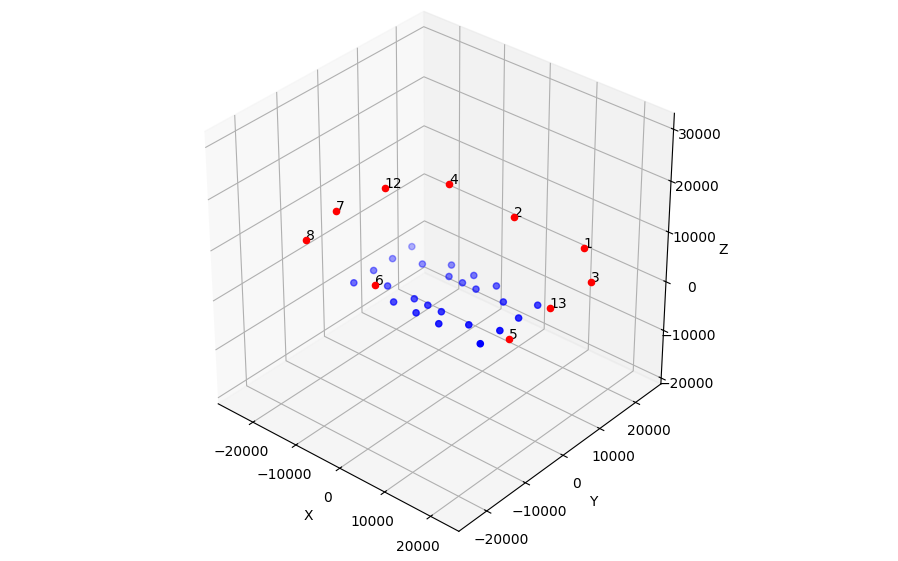
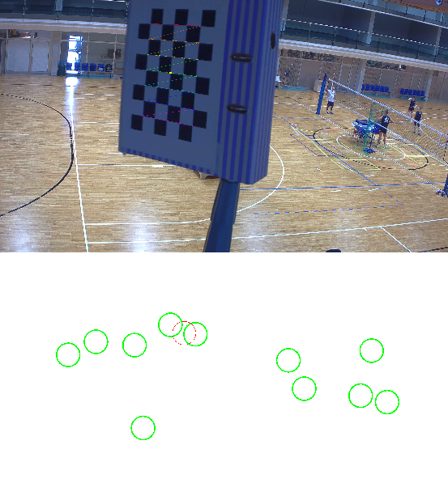
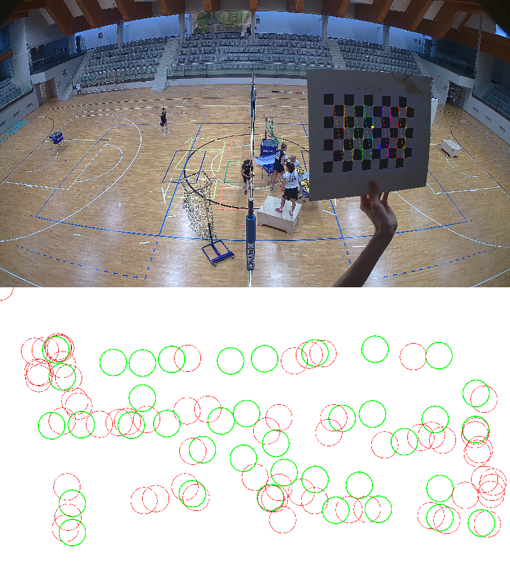
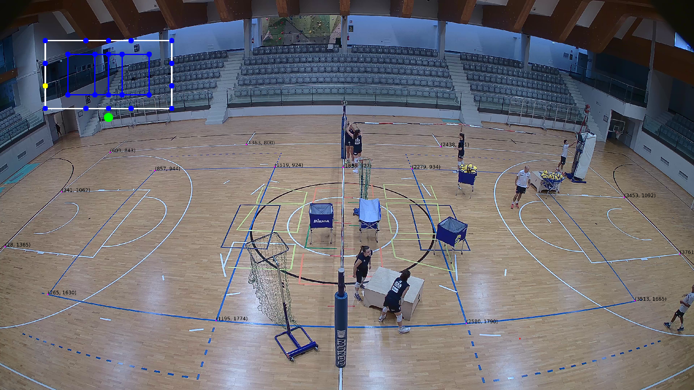
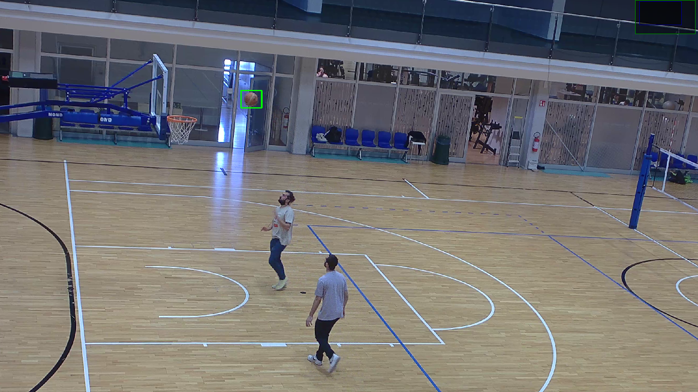
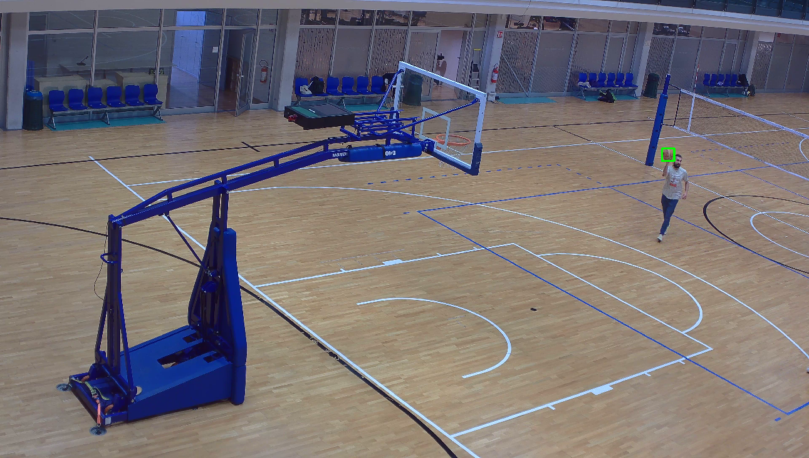
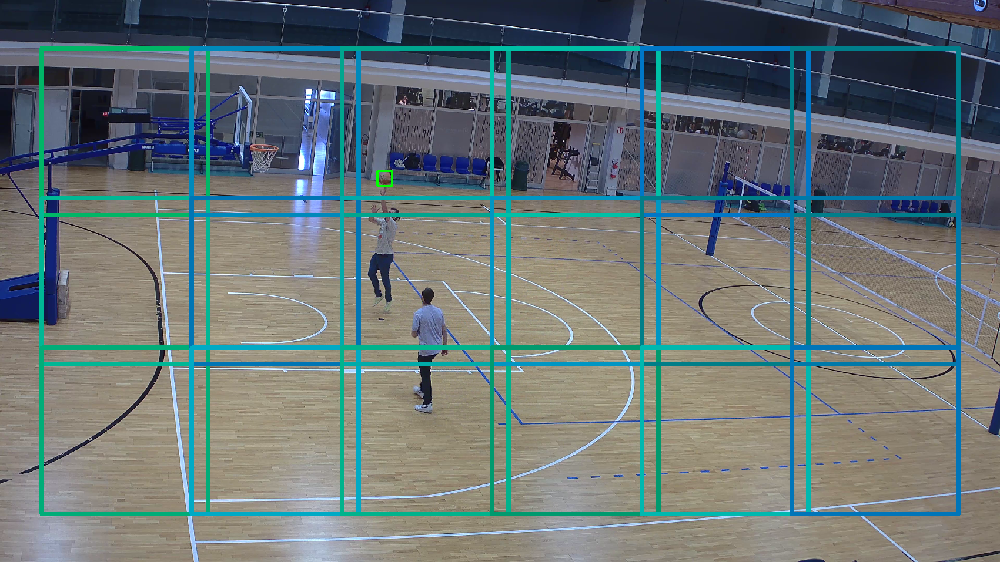
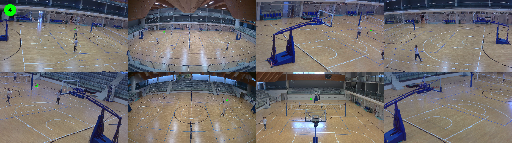
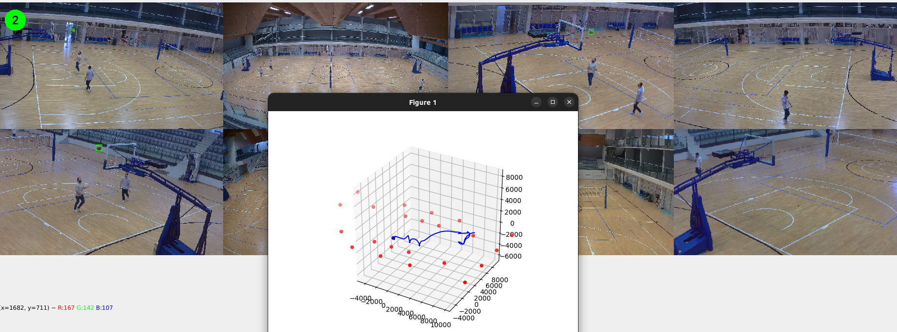
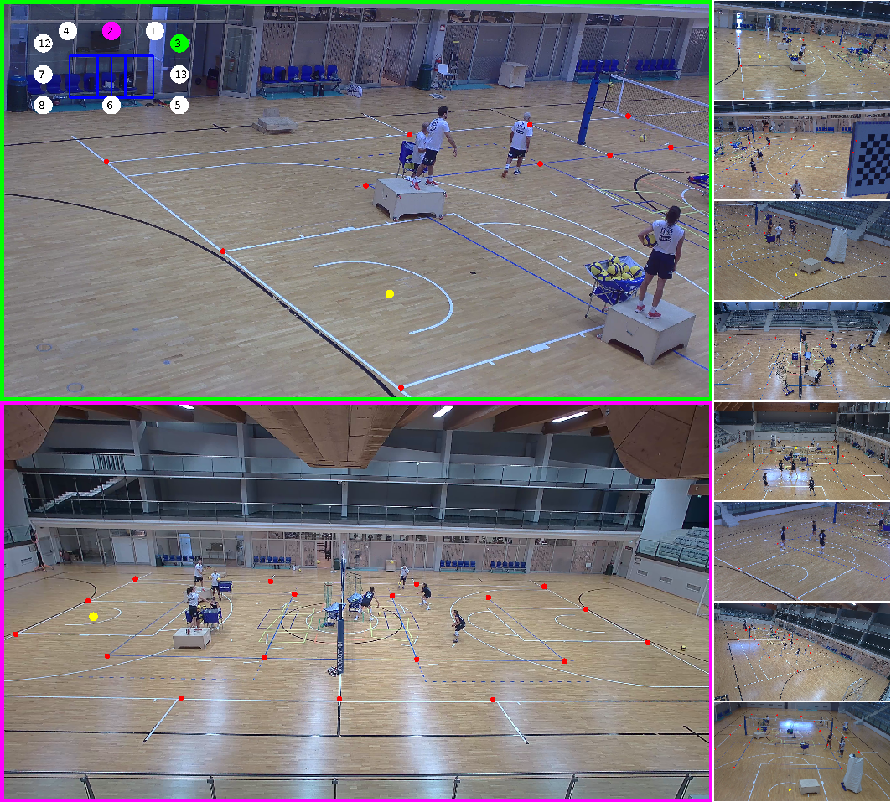

# FAH (Funny Achronym Here)

Project for Computer Vision, UniTN

<div style="text-align:center;">


</div>

## About
The goal of the project is to build a system that can track a ball in a 3D space using multiple cameras. Our objective is to develop a tool able to make the setup of the cameras easy, fast and precise, and to provide a simple and intuitive interface to the user. 

<br>
<div style="text-align:center;">

</div>
<br>

## General Information


### Project Structure

```

CVBallTracking
├── data
│   ├── camera_data
│   │   ├── cam_1
│   │   │   ├── calib
│   │   │   │   ├── camera_calib.json
│   │   │   │   └── img_points.json
│   │   │   ├── dump
│   │   │   │   ├── dump_20240408_125237.json
│   │   │   │   └── ...
│   │   │   └── metadata.json
│   │   ├── cam_2
│   │   │   └── ...
│   │   ├── camera_positions.json
│   │   └── chess_sizes.json
│   └── video
│       ├── out1F.mp4
│       └── ...
├── weights
│   └── best.pt
├── yolotools
│   ├── datasets
│   │   └── ...
│   ├── agument_diy.py
│   ├── annotator.py
│   ├── checklabels.py
│   ├── data.yaml
│   ├── sliced_yolo.py
│   ├── split.py
│   ├── test_multicam.py
│   ├── train.ipynb
│   └── train.py
├── 3dplot.py
├── build_map.py
├── calibrate_cameras.py
├── calib_test.py
├── camera_controller.py
├── common.py
├── corners_detection.py
├── kalman.py
├── multiple_views.py
├── multi_track_demo.py
├── pose_estimation.py
├── README.md
├── setup.py
└── sort.py

```


## Usage

The project is divided into two main parts: the calibration and the tracking. Each step is indipedent from the other, so you can run them separately, however in order to execute the tracking you need to have calibration and pose estimation done.


## Calibration

Camera calibration is composed of 3 steps to be executed in order:
- **Corners detection** crates a dump of the chessboard corners in the images and saves them in a json file for each camera
- **Calibration** uses the dumps to calibrate the cameras and save the calibration parameters in a json file
- **Pose estimation** uses the calibration parameters to estimate the pose of the cameras and save them in a json file

### Corners detection

To detect the corners of the chessboard in the images you need to run the `corners_detection.py` script. 


```
usage: corners_detection.py [-h] [-cs] [-dn] [-dt]

Runs corner detection

options:
  -h    show this help message and exit
  -cs   Set the indexes of the cameras you want to calibrate separated by comma
  -dn   Minimum number of detections to stop the process [20]
  -dt   Distance threshold between detections [100]

```

The program will run the corner detection for each camera and save the results in the `data/camera_data/cam_i/dump` folder. A window will show the progress and the distribution of detected corners in the image.



### Camera Calibration

In order to calibrate the cameras you need to run the `calibrate_cameras.py` script. By selecting the camera you want to calibrate, the program will load the dumps and proceed automatically. The calibration parameters will be saved in the `data/camera_data/cam_i/calib` folder.

```
usage: calibrate_cameras.py [-h] [-cs]

Run camera calibration

options:
  -h    show this help message and exit
  -cs   Set the indexes of the cameras you want to calibrate separated by comma
```

### Pose Estimation

The last step of the calibration is the pose estimation. By running the `pose_estimation.py` script you will be able to estimate the pose of the cameras and save the results in the `data/camera_data/cam_i/calib` folder.


```
usage: pose_estimation.py [-h] [-c] [-R]

Run pose estimation

options:
  -h    show this help message and exit
  -c    Set the index of the camera you want to calibrate
  -R    Reuse old screen point data
```
The pose estimation tool will open and you will be asked to select the visible corners of the volleyball and basketball court, follow the instructions on the screen to complete the process. The green dot represents the camera position and the yellow dot represent the corner of the court you need to select. 



```
Press 'a' to Add a point
Press 's' to Skip a point
Press 'r' to Remove the last point
Press 'c' to Continue with the video
Press 'q' to Quit or continue
```
Once all visible corners are selected press 'q' and the script will automatically compute the camera pose and save it in the folder.

If you want to reuse the screen points selected in a previous run you can use the `-R` flag and the pose estimation will be directly computed.

## Detection

In the folder `yolotools` you can find the scripts to create the dataset, train the model and test it. The dataset is composed of images and labels, the labels are in the YOLO format. The final system uses a YOLOv8n model.

### Annotation

The annotation tool is a simple script that allows you to annotate the images with the bounding boxes of the balls. The script will create a new dataset folder with a timestamp and progressively save the annotations in the YOLO format and the frames in two separate folders 'images' and 'labels'.



```
press 's' to skip 1 frame
press 'd' to skip 10 frames
press 'a' to go back 10 frames
press 'r' to jump to random frame
press 'f' to save annotation
press 'n' to switch to next camera
press 'q' to exit
```
As you proceed with the annotation the script will show the progress and the number of annotations for each camera in the terminal.

### Data Augmentation

Since not much data was available for the training of the model, we decided to augment the dataset by generating new samples. The script will generate a balanced dataset with 50% of the samples with the ball and 50% without the ball. The new samples will be saved in a new folder with the same structure as the original dataset.

```
usage: agument.py [-h] [-d] [-t] [-s]

Agument dataset

options:
  -h  show this help message and exit
  -d  Dataset path
  -t  Target dataset path
  -s  Set the amount of samples to generate
```
### Data Splitting

This script allows you to split the dataset in train, test and validation sets. The script will create a new folder with the correct structure for a YOLO dataset, copying the images and labels in the correct folders and insert the `data.yaml` file needed for training.
```
usage: split.py [-h] [-d] [-t]

Splits dataset in train test val

options:
  -h  show this help message and exit
  -d  Dataset path
  -t  Target dataset path
```
You can check if the dataset was correctly created by running the `checklabels.py` script. The script will show the images with the bounding boxes of the balls.

### Training

Finally you can train the model by running the `train.py` script. The script will load the dataset and start the training process.

### Test Detection

You can test your model by running the `test_multicam.py` script. The script will load the model weights (don't forget to put them in the `weights` folder or to set `model_path`) and run the detection on the video. 



```
Press 'n' to switch camera
Press 'd' to skip 10 frames
Press 'a' to go back 10 frames
Press 'q' to exit
```

Detection uses the **SlicedYOLO** system, by default the windowing is $640 \times 640$ pixels with 10% overlap on both axis, you can try different configurations by uncommenting the lines at the beginning of the script.


<div style="display:flex;">
  
  
</div>

Two examples of sliced inference, many smaller windows are more precise but also slower.

## Tracking

The tracking demo can be run by executing the `multi_track_demo.py` script. The script will load the calibration parameters and the model weights and start the tracking process.



The dot in the top left corner represents how many cameras are detecting the ball, if it's green it means the system is tracking the ball, if it's red it means it's not. To track the ball the system needs at least 2 cameras detecting the ball for no less than 3 consecutive frames (to avoid false positives).

```
usage: multi_track_demo.py [-h] [-m] [-s] [-e] [-F]

Multi camera tracking demo

options:
  -h  show this help message and exit
  -m  Performance mode [higher -> more precise & slower]
  -s  Starting frame
  -e  End frame
  -F  Use detections from file
```
Even though the possibility to use single window detection is given (**-m 1**) it's NOT recommended. The tracker is designed to be run at native resolution $640 \times 640$ (**-m 4**) for the best results and constant lock. Modes **2** and **3** are also available, they are a compromise between speed and precision, feel  free to experiment with different resolutions.

By pressing 'q' you can exit the program and the tracking will stop. A window will be shown with the 3D plot of the ball trajectory.



## Additional Tools

### Split View

The `split_view.py` script allows you to visualize the cameras in the corrispettive positions. The tool will show two cameras at a time and you can cycle between them by pressing 'a' and 'd'. The diagram in the top left shows which cameras are currently shown.
You can click anywhere on the screen to see where that point falls on the court in the other camera views.




```
press 'a' to cycle through the cameras on the top quadrant (green)
press 'd' to cycle through the cameras on the bottom quadrant (purple)
press 'q' to exit
```

### more

In the `tools` are present some more tools for visualization and testing.


## Contacts 

- [@lorenzoorsingher](https://github.com/lorenzoorsingher)
- [@AlessiaPivotto](https://github.com/AlessiaPivotto)
- [GitHub repo](https://github.com/lorenzoorsingher/CVBallTracking)
